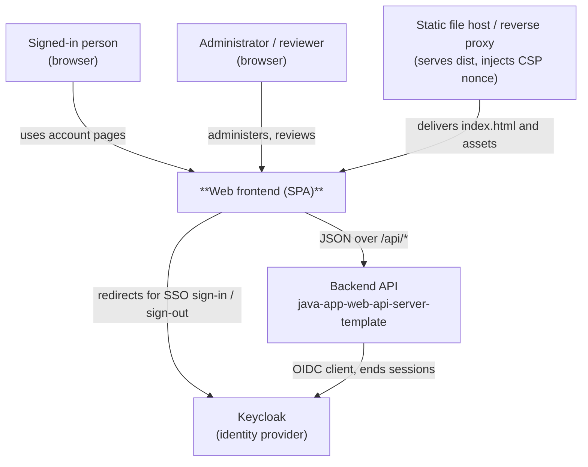
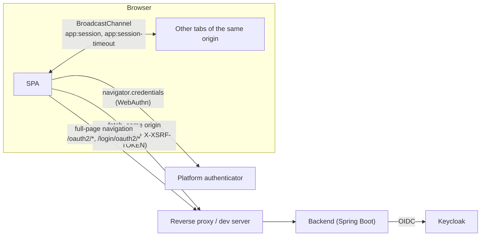

# 3. Context and Scope

<!-- arc42: Delimits your system from all its communication partners (neighboring
systems and users). Specifies the external interfaces. -->

The system in scope is the **single-page application** only. The backend (`java-app-web-api-server-template`) and Keycloak are neighbouring systems, not part of this document's system.

## 3.1 Business Context

<!-- arc42: Specification of all communication partners with explanations of
domain specific inputs and outputs or interfaces. -->

<!-- arc42-generated -->

| Communication Partner    | Input                                                                                                        | Output                                                                                                     |
| ------------------------ | ------------------------------------------------------------------------------------------------------------ | ---------------------------------------------------------------------------------------------------------- |
| Signed-in person         | Clicks, keyboard input, passkey confirmation                                                                 | Account pages, sign-in card, session warning                                                               |
| Administrator / reviewer | Filters, selections, decisions with a reason                                                                 | Lists, detail pages, confirmation dialogs, audit trail                                                     |
| Backend API              | `GET /api/login-user`, list and detail reads, writes (`POST`, `PUT`, `PATCH`, `DELETE`) with the CSRF header | Users, groups, roles, review tasks and items, audit events, settings, passkeys, RFC 9457 problem responses |
| Keycloak                 | Browser navigation to the backend's `/oauth2/authorization/keycloak`                                         | Redirects back to `/`; the backend sets the session cookie                                                 |
| Static file host         | Request for the page                                                                                         | `index.html` with a fresh CSP nonce and the matching response headers                                      |

<!-- /arc42-generated -->

## 3.2 Technical Context

<!-- arc42: Technical interfaces (channels and transmission media) linking your
system to its environment. Mapping of domain specific I/O to channels. -->

<!-- arc42-generated -->

| Interface                      | Protocol                                                                   | Format                                                                                             | Notes                                                                                                                                |
| ------------------------------ | -------------------------------------------------------------------------- | -------------------------------------------------------------------------------------------------- | ------------------------------------------------------------------------------------------------------------------------------------ |
| `/api/*`                       | HTTPS, same origin                                                         | JSON; errors as RFC 9457 `application/problem+json`                                                | The `/api` prefix is stripped by the proxy before the backend sees it. Paged lists use `page`, `size`, `sort` and per-field filters. |
| `/oauth2/*`, `/login/oauth2/*` | HTTPS, browser navigation                                                  | HTTP redirects                                                                                     | Kept at their real backend paths because Keycloak's registered redirect URI depends on them.                                         |
| Session and CSRF               | Cookies                                                                    | Opaque session cookie; `XSRF-TOKEN` readable and echoed as `X-XSRF-TOKEN`                          | Reads do not need the header.                                                                                                        |
| Cross-tab messaging            | `BroadcastChannel`                                                         | `app:session` carries `signed-out` or `expired`; `app:session-timeout` carries activity timestamps | Any same-origin script can post to these channels.                                                                                   |
| Passkeys                       | WebAuthn through `navigator.credentials`, plus Spring Security's endpoints | Base64url-encoded JSON                                                                             | `src/shared/lib/webauthn-codec.ts` does the encoding by hand.                                                                        |
| Page delivery                  | HTTPS                                                                      | `dist/index.html` containing the placeholder `__CSP_NONCE__`                                       | The server must replace it on every response and send a matching `Content-Security-Policy` header (ADR 0005).                        |

<!-- /arc42-generated -->
