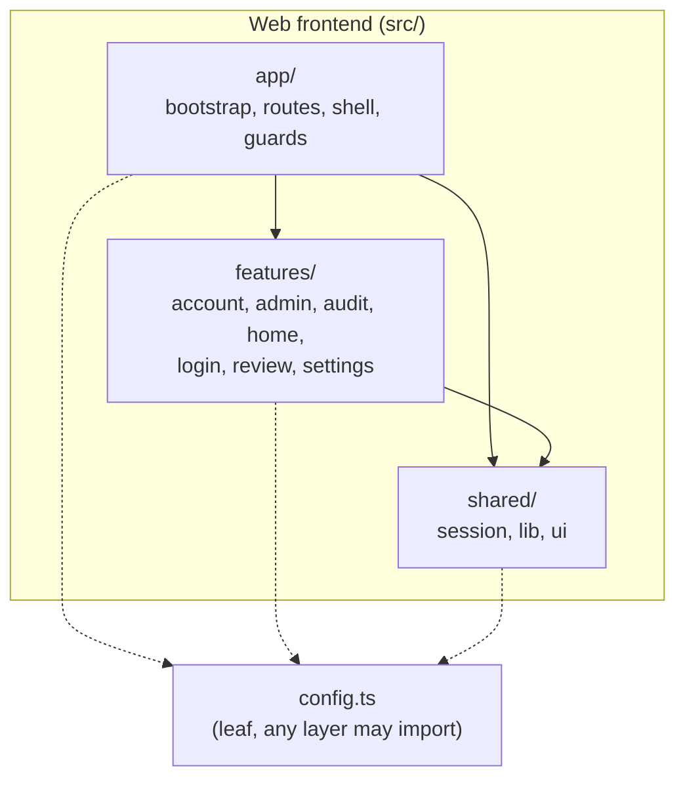
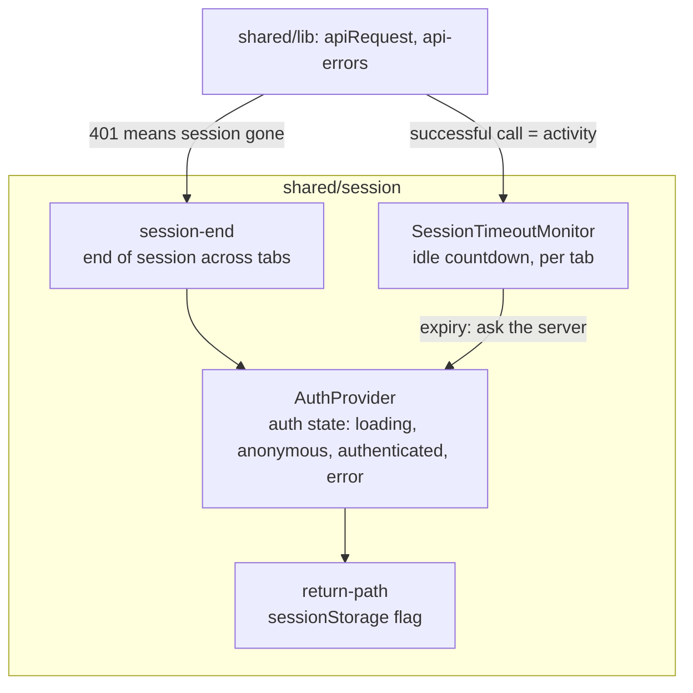

# 5. Building Block View

<!-- arc42: Static decomposition of the system into building blocks (modules,
components, subsystems, classes, interfaces, packages, libraries, frameworks,
layers, partitions, tiers, functions, macros, operations, data structures, ...)
as well as their dependencies (relationships, associations, ...) -->

## 5.1 Whitebox Overall System (Level 1)

<!-- arc42-generated -->

**Motivation:** a trimmed Feature-Sliced Design (ADR 0002). Imports go only downward; a feature never imports another feature or `app`. Shared code has no knowledge of any feature.

### Contained Building Blocks

| Building Block      | Responsibility                                                                                                                                                   | Interfaces                                                                                    | Code Location                          |
| ------------------- | ---------------------------------------------------------------------------------------------------------------------------------------------------------------- | --------------------------------------------------------------------------------------------- | -------------------------------------- |
| `app`               | Entry composition: routes, `AuthGate` (sign-in in place), `RequireAdmin` (role guard), `AppShell` and the two layouts, the idle-timeout modal, the router bridge | Renders features; fills slots such as the overview's attention card                           | `src/app/`, `src/main.tsx`             |
| `features/account`  | Personal info (read-only) and the passkey manager                                                                                                                | `/api/account/passkeys`, WebAuthn endpoints                                                   | `src/features/account/`                |
| `features/admin`    | Users and groups: lists, detail pages, forms, suspend, unsuspend and remove; the overview                                                                        | `/api/admin/users`, `/groups`, `/roles`                                                       | `src/features/admin/`                  |
| `features/audit`    | Read-only audit trail with filters                                                                                                                               | `/api/audit-events`                                                                           | `src/features/audit/`                  |
| `features/home`     | The signed-in person's home page                                                                                                                                 |                                                                                               | `src/features/home/`                   |
| `features/login`    | The sign-in card: SSO and passkey sign-in                                                                                                                        | `/oauth2/authorization/keycloak`, `/api/webauthn/authenticate/options`, `/api/login/webauthn` | `src/features/login/`                  |
| `features/review`   | Account review: tasks, items, decisions, the open-task summary, the attention card                                                                               | `/api/tasks`, `/api/tasks/summary`, `/api/account-reviews/tasks/*`                            | `src/features/review/`                 |
| `features/settings` | Inactivity and review-period settings                                                                                                                            | `/api/admin/settings`                                                                         | `src/features/settings/`               |
| `shared/session`    | The signed-in user, session lifecycle, idle timeout, cross-tab end of session, return path, re-authentication                                                    | `AuthProvider`, `useAuth`, `SessionTimeoutMonitor`                                            | `src/shared/session/`                  |
| `shared/lib`        | Fetch wrapper, error mapping, CSRF, mutation, paged-list and single-resource hooks, formatting, WebAuthn codec                                                   | `apiRequest`, `useMutation`, `usePagedList`, `useResource`                                    | `src/shared/lib/`                      |
| `shared/ui`         | Reusable components: `DataTable`, `Footer`, `Card`, `PageHeader`, modals, pickers, `FilterSelect`, `ErrorBoundary`, `LoadError` and more                         | One folder per component with an `index.ts`                                                   | `src/shared/ui/`                       |
| Build tooling       | Vite config with the dev proxy, and the CSP plugin                                                                                                               | `BACKEND_URL` environment variable                                                            | `vite.config.ts`, `vite-plugin-csp.ts` |

<!-- /arc42-generated -->

## 5.2 Level 2

<!-- arc42: Decompose selected building blocks from Level 1. Only decompose
blocks that are important, risky, or particularly complex. -->

### shared/session (White Box)

<!-- arc42-generated -->

| Component                        | Responsibility                                                                                                                     |
| -------------------------------- | ---------------------------------------------------------------------------------------------------------------------------------- |
| `AuthProvider`                   | Loads `GET /api/login-user`, exposes `useAuth`, runs sign-out, reacts to a session ending anywhere.                                |
| `SessionTimeoutMonitor`          | Warns before the idle deadline, extends silently after recent local activity, and keeps tabs in step through a `BroadcastChannel`. |
| `session-end`                    | One place that ends the session: forgets saved list state, remembers why, tells every tab and this tab's listener, in a fixed order. |
| `return-path`                    | A small `sessionStorage` flag for returning to a page after sign-in.                                                              |

### shared/lib data hooks (White Box)

| Component                | Responsibility                                                                                                               |
| ------------------------ | ---------------------------------------------------------------------------------------------------------------------------- |
| `apiRequest`, `apiFetch` | Same-origin `fetch` with the CSRF header on writes and the shared error mapping; successful calls count as session activity. |
| `api-errors`             | `ApiError`, `ValidationError`, `ReauthenticationRequiredError`, `failureKind`; maps RFC 9457 problem responses.              |
| `useMutation`            | Wraps a write: re-authentication redirect, per-field validation messages, one error message.                                 |
| `usePagedList`           | Server-paged list state (page, sort, search, filters), persisted in `sessionStorage` per list.                               |
| `useResource`            | Loads one thing as `loading`, `loaded` or `error`; reload keeps data on screen.                                              |

<!-- /arc42-generated -->

## 5.3 Level 3

<!-- arc42-manual: Further decompose Level 2 blocks where needed for complex or risky components -->
<!-- /arc42-manual -->
