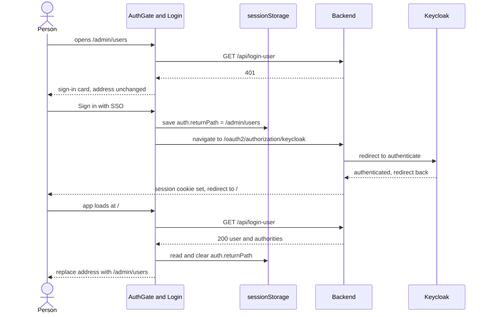
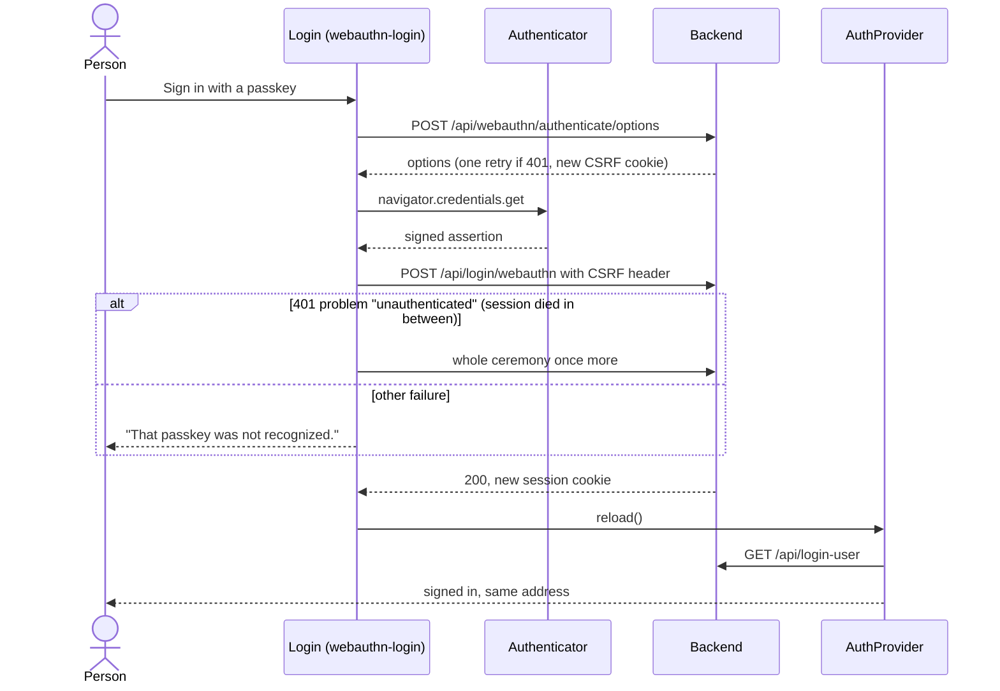
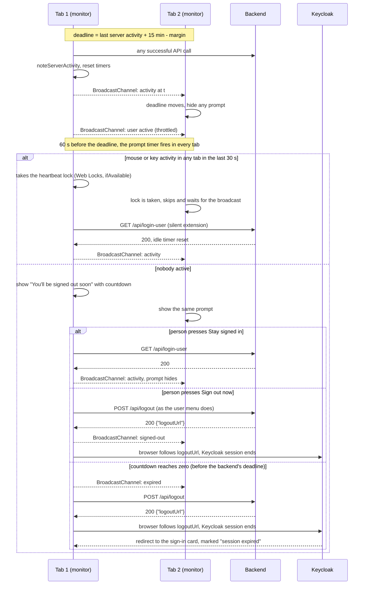
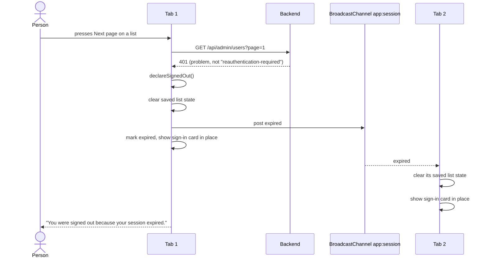
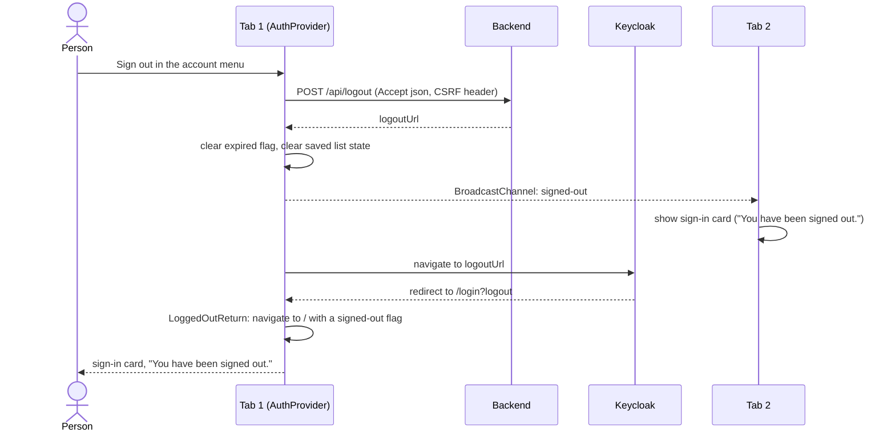
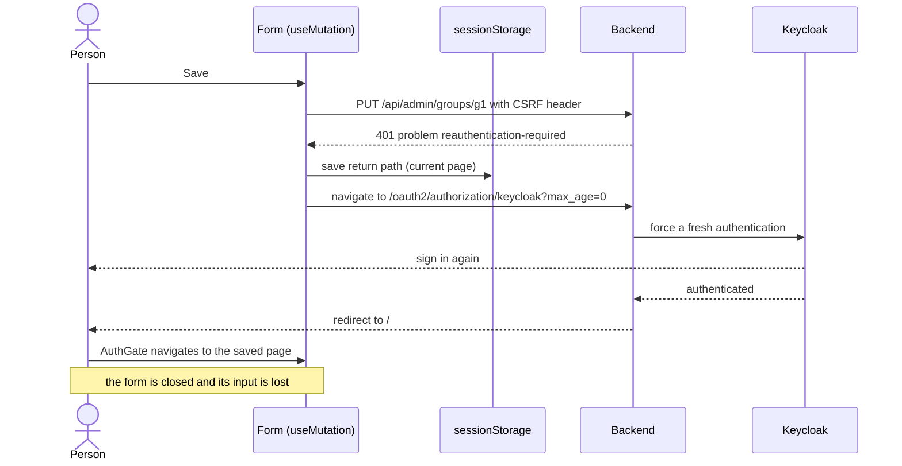
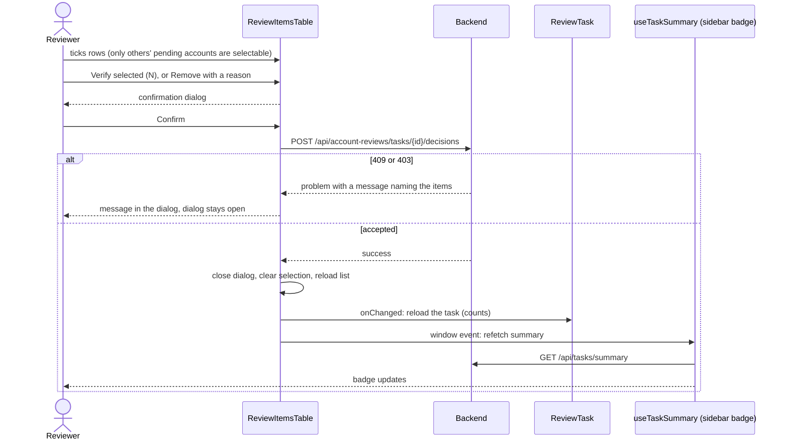
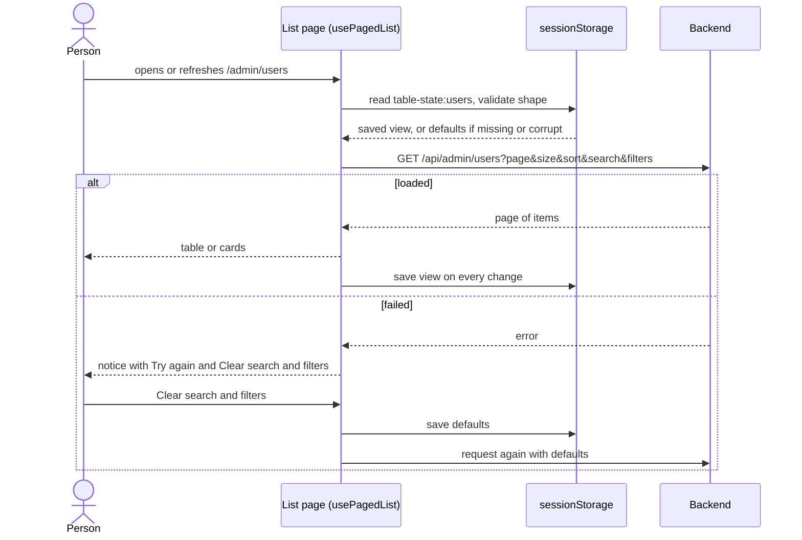
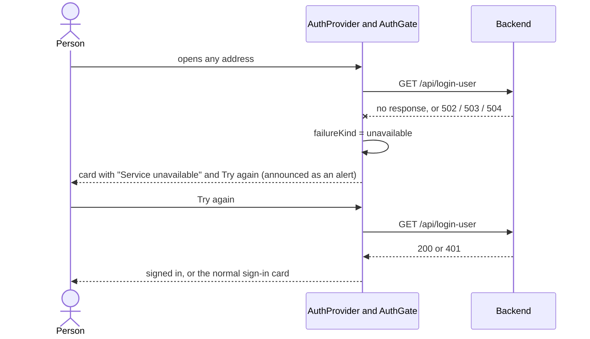
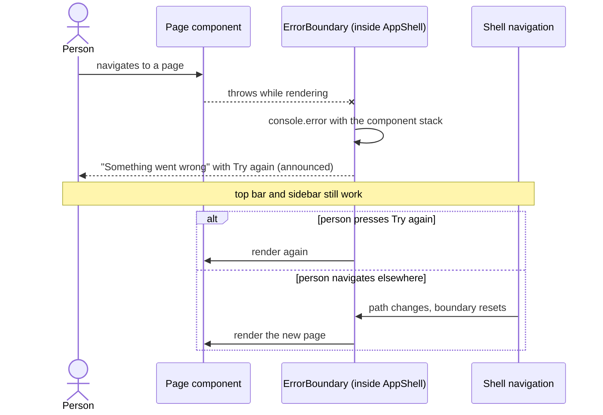

# 6. Runtime View

<!-- arc42: Behavior of building blocks as scenarios, covering important use
cases or features, interactions at critical external interfaces, operation
and administration, error and exception scenarios. -->

Only architecturally relevant scenarios are shown: the flows that cross the browser, the backend and Keycloak, or that coordinate several tabs. Each is described from the code as it is. Participant names match the building blocks in [section 5](05-building-block-view.md).

| #   | Scenario                                   | Why it matters                                                                                       |
| --- | ------------------------------------------ | ---------------------------------------------------------------------------------------------------- |
| 1   | Sign in with single sign-on                | A full-page round trip through Keycloak that must bring the person back to the page they asked for.  |
| 2   | Sign in with a passkey                     | A browser ceremony with a retry when the old session has died.                                       |
| 3   | Idle warning and keeping the session alive | Three tabs, one deadline, and a timer that must not be defeated by background requests.              |
| 4   | The session ends                           | One tab finds out; every tab must show the sign-in card and forget saved state.                      |
| 5   | Sign out                                   | Two sessions to end (application and Keycloak) and the other tabs to tell.                           |
| 6   | Re-authentication for a sensitive write    | A write refused for an old login, a detour through Keycloak, and returning to the page.              |
| 7   | Deciding on review items in bulk           | The longest write flow: selection, confirmation, all-or-nothing request, and refreshing three views. |
| 8   | A list loads, with restored state          | Where saved list state is read and where a failure is handled.                                       |
| 9   | The backend cannot be reached              | Failure at start-up, before anyone is known to be signed in.                                         |
| 10  | A page fails while rendering               | An exception in the UI must not leave a blank screen.                                                |

## Scenario 1: Sign in with single sign-on

<!-- arc42-generated -->

**Overview:** an anonymous visitor asks for any address. `AuthGate` shows the sign-in card at that address. SSO leaves the application for Keycloak and returns to the one address Keycloak has registered, `/`, so the requested page is remembered before leaving (ADR 0004).

**Steps:**

1. The first `GET /api/login-user` returns `401`, so the sign-in card is shown where the person is.
2. `Login` saves the path (unless it is already `/`) and navigates the whole browser to the backend's OAuth path.
3. After Keycloak, the backend sets the session cookie and returns to `/`. The app starts again and loads the user.
4. `AuthGate` sees an authenticated user at `/`, consumes the saved path, and navigates there with `replace`.

**Notes:** if storage is unavailable the saved path is lost and the person lands on `/`. An abandoned sign-in leaves the saved path in that tab, so a later sign-in from `/` goes there.
<!-- /arc42-generated -->

## Scenario 2: Sign in with a passkey

<!-- arc42-generated -->

**Overview:** no redirect: the person stays on the same address. If the browser still holds a dead session cookie, the backend answers the options request with a `401` and a fresh session, and the ceremony is retried once.

**Notes:** only the `urn:problem:unauthenticated` `401` triggers the retry. A rejected assertion returns an empty `401` and is not retried, since asking again would prompt for a passkey that will not work.
<!-- /arc42-generated -->

## Scenario 3: Idle warning and keeping the session alive

<!-- arc42-generated -->

**Overview:** the backend ends an idle session after a configured time, mirrored in `SESSION_IDLE_TIMEOUT_MS` (15 minutes). Every tab runs its own `SessionTimeoutMonitor` against the same deadline, which is a little earlier than the backend's (`SESSION_EXPIRY_MARGIN_MS`, see the notes), and tells the others when the deadline moves or the person is active.

**Notes:** the prompt is shown only when nobody has recently used the mouse or keyboard in any tab. When several tabs would extend at once, one takes a browser-wide lock and makes the request; the others skip it, and prompt anyway if its result does not arrive within a few seconds.

**Why the frontend ends the session before the backend does.** Keycloak's session is ended only when the browser visits the `logoutUrl` that `POST /api/logout` returns, and the backend builds that URL (with the `id_token_hint`) from the signed-in user's ID token, which only exists while the backend session is alive. If the frontend waited for the backend's own expiry, there would be no session left to ask, no `id_token_hint`, and Keycloak's session would live on (ADR 0025 in the backend repository). So the countdown ends `SESSION_EXPIRY_MARGIN_MS` early, which must exceed network latency, since the frontend starts counting when a response arrives and the backend when it handled the request.

Reaching zero never asks the server whether the session is still alive: any authenticated request counts as activity and could extend a session nobody chose to keep. If `POST /api/logout` fails anyway (for example the session is already gone), the sign-in card is shown in place and Keycloak is not told, so Keycloak's SSO idle timeout should not exceed the backend's. The backend's non-extendable absolute timeout is discovered by the next request that fails (see scenario 4). **Every successful API call counts as activity**, as it does on the backend, so any background polling would keep the session alive for ever; none exists, and none should be added without a way to mark it as background.
<!-- /arc42-generated -->

## Scenario 4: The session ends

<!-- arc42-generated -->

**Overview:** the session can end for reasons the browser did not cause: idle or absolute timeout, an administrator revoking it, or a newer login elsewhere. The first request that returns `401` finds out. Every tab then shows the sign-in card where it is, and nothing is left looking at pages that no longer work.

**Notes:** saved list state (`table-state:*`) is per tab, so each tab clears its own. Search text can identify a person, which is why clearing is part of the behaviour and is tested. A `401` that is a `reauthentication-required` problem is not a session end (scenario 6).
<!-- /arc42-generated -->

## Scenario 5: Sign out

<!-- arc42-generated -->

**Overview:** signing out must end both the application's session and Keycloak's, and tell the other tabs, without them sitting on stale pages.

**Notes:** `/login?logout` exists only because that address is registered with Keycloak; it immediately redirects to `/`. If `POST /api/logout` fails, the app shows the error state in the card and the session is unchanged.
<!-- /arc42-generated -->

## Scenario 6: Re-authentication for a sensitive write

<!-- arc42-generated -->

**Overview:** administration writes and registering a passkey need a recent sign-in. A stale one is refused with a problem of type `reauthentication-required`, and `useMutation` sends the person through Keycloak again with `max_age=0`.

**Notes:** the page is restored, not the form: anything typed is lost, and the person repeats the change. This is deliberate and documented in the README.
<!-- /arc42-generated -->

## Scenario 7: Deciding on review items in bulk

<!-- arc42-generated -->

**Overview:** a reviewer ticks accounts and verifies or removes them. The request is all-or-none, so one blocked item refuses the lot and the server's message names it. Success refreshes three things: the list, the task's counts, and the sidebar badge.

**Notes:** the selection survives paging and sorting but is cleared when the search or a filter changes, since a permanent removal must never act on rows that are out of view. A dialog's last error is cleared when it closes.
<!-- /arc42-generated -->

## Scenario 8: A list loads, with restored state

<!-- arc42-generated -->

**Overview:** every server-paged list reads its saved view from `sessionStorage` before the first request, so a hard refresh returns to the same page, search, filters and sort (ADR 0003).

**Notes:** a response for a page past the end (after deleting the last row of the last page) moves to the last page that exists. Search and text filters are debounced so each keystroke is not a request. A `403` shows "You do not have permission to do this." as a warning with no retry, since trying again cannot help.
<!-- /arc42-generated -->

## Scenario 9: The backend cannot be reached

<!-- arc42-generated -->

**Overview:** at start-up nothing is yet known about the session. If `GET /api/login-user` cannot be completed, the app must not flash the sign-in form as if the person were signed out.

**Notes:** a missing response (a rejected `fetch`) and the three gateway statuses are "unavailable"; anything else is "failed", with different wording. Raw error detail goes to the console, not the screen.
<!-- /arc42-generated -->

## Scenario 10: A page fails while rendering

<!-- arc42-generated -->

**Overview:** an exception thrown while rendering a page would otherwise unmount the whole tree and leave a blank screen. The error boundary sits inside the shell, around the page content only.

**Notes:** only render-time errors are caught. Errors in event handlers and failed requests are handled where they happen (the mutation hook and each page's error state).
<!-- /arc42-generated -->

<!-- arc42-manual: Document further error and exception scenarios -->
<!-- /arc42-manual -->
