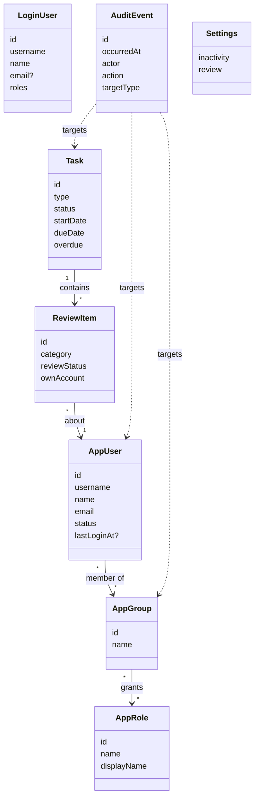

# 8.1 Domain Model

<!-- arc42-generated -->

The frontend owns no data. The model below is the shape of what the backend returns, as typed in each feature's `api.ts`.

| Concept                      | Meaning                                                                                                                                         |
| ---------------------------- | ----------------------------------------------------------------------------------------------------------------------------------------------- |
| Signed-in user (`LoginUser`) | The caller, with their authorities (`ROLE_USER_MANAGE`, `ROLE_GROUP_MANAGE`, `ROLE_ACCOUNT_REVIEWER`, `ROLE_SETTINGS_MANAGE`).                  |
| User, group, role            | A user's roles come only from their groups. Roles are read-only: the group form picks them.                                                     |
| Suspension                   | A suspended user is signed out and cannot sign in; it keeps its review status. Removal is permanent and leaves only the audit trail.            |
| Review task and item         | A task is a review period with a due date; its items are the accounts to verify, remove or suspend. A reviewer cannot act on their own account. |
| Audit event                  | Append-only record of a change, with an actor, a target, an optional reason code and note, and details.                                         |

<!-- /arc42-generated -->
